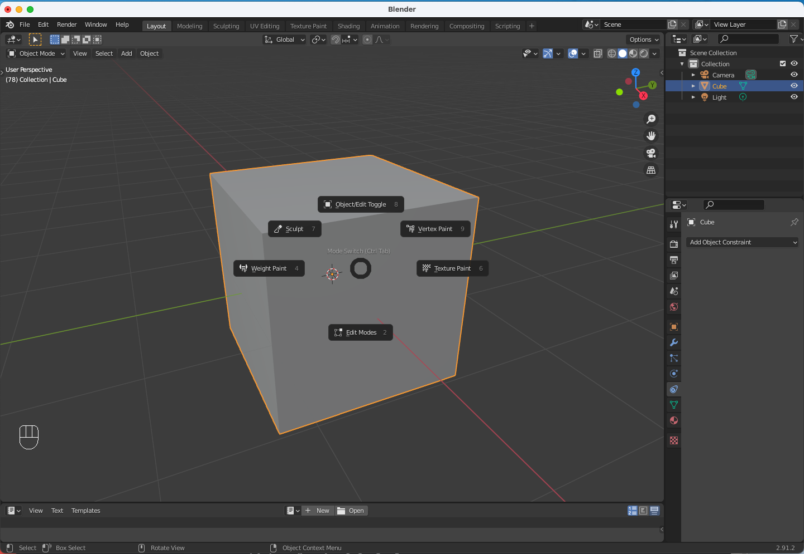
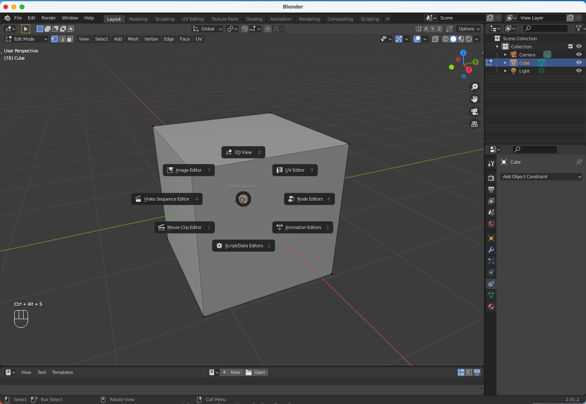

<kbd>Ctrl</kbd> + <kbd>Alt</kbd> + <kbd>Space</kbd>

## b

## [3D Viewport Pie Menus](https://docs.blender.org/manual/en/2.91/addons/interface/viewport_pies.html)

Mode Switch <kbd>Ctrl</kbd> + <kbd>Alt</kbd>
   Switch between Object Type Modes.

Editor Switch :<kbd>Ctrl</kbd> + <kbd>Alt</kbd> + <kbd>S</kbd>
   Switch Editor Modes from any editor space.
   
   
   
   
   
   
   
   Activation
==========

- Open Blender and go to Preferences then the Add-ons tab.
- Click Interface then 3D Viewport Pie Menus to enable the script.

Description
===========

Animation `Shift-Spacebar`:
   This menu allows you to change the animation Play Settings from the viewport.

Apply Transforms `Ctrl-A`:
   This menu allows you to change the mode of the manipulator to move, rotate, scale or combination using.

Edit Align :kbd:`Alt-X`:
   This menu allows you to align vertices/edges/faces to each other in Edit Mode.

Edit Delete :kbd:`X`
   Extended menu for deletion of vertices/edges/faces in Edit Mode.

Editor Switch :kbd:`Ctrl-Alt-S`
   Switch Editor Modes from any editor space.

Manipulator Menu :kbd:`Alt-Spacebar`
   Manipulator on off and combinations.

Mode Switch :kbd:`Ctrl-Tab`
   Switch between Object Type Modes.

Origin :kbd:`Ctrl-Alt-X`
   This menu allows you to move the cursor and set the object origin or pivot.

Save Open :kbd:`Ctrl-S`
   Save, Open, Import files menus.

Sculpt :kbd:`W`
   Easy open your Brushes with this pie menu.

Select :kbd:`A`
   Menu of selection types.

Shading :kbd:`Z`
   Shading viewport display.

View Numpad :kbd:`Q`
   Numpad View Directions.

### Edit Mesh Tools
##############
  Mesh Tools
##############

.. toctree::
   :maxdepth: 2

   transform/index.rst
   mirror.rst
   duplicate.rst
   extrude.rst
   merge.rst
   split.rst
   separate.rst
   bisect.rst
   knife_project.rst
   convex_hull.rst
   symmetrize.rst
   snap_symmetry.rst
   normals.rst
   shading.rst
   sort_elements.rst
   cleanup.rst
   delete.rst

.. admonition:: Reference
   :class: refbox

   :Category:  Interface
   :Description: Individual and optional pie menu activation.
   :Location: 3D Viewport
   :File: space_view3d_pie_menus folder
   :Author: meta-androcto
   :Maintainer: meta-androcto
   :License: GPL
   :Support Level: Community
   :Note: This add-on is bundled with Blender.
   
